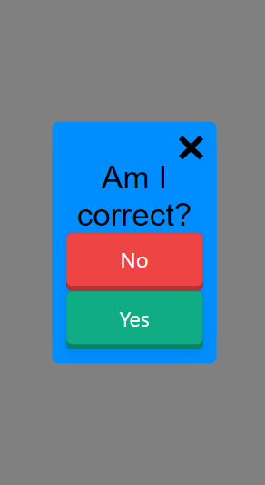

# Modelify

*Small, clean, modern*

Modelify is a tool that makes **easy, user-friendly modals** using vanilla JavaScript.

> [View a live demo](https://92eli.github.io/modelify/demo.html)

## Usage

1. Require the library and CSS:

```
<link rel="stylesheet" type="text/css" href="modelify/modelify.css">
<script src="modelify/modelify.js">
```

> Note: Make sure to put the `<script>` tag before you first use the `Modelify` object

The [pushy buttons library](https://github.com/iRaul/pushy-buttons) is also recomended, but not required (you will need your own styles for the buttons, though):
```
<link rel="stylesheet" type="text/css" href="pushy-buttons.min.css">
```

2. Use the library

```
Modelify.info("This library is great!");
Modelify.prompt("Agree?").then(resp => {
    if (resp === 0) {
        alert(":(");
    } else {
        alert(":)");
    }
});
```

### Small

Only 6MB minified!

### Clean

```Modelify.info("This library is great!"); // so easy!```

Optimized for mobile



### Modern

`Modelify.prompt("Agree?").then(resp => { handleResp(resp) });`

- Uses promise API
- Choice buttons use flexbox

### Easy

No more `alert()`ing to users!

## Full Documentation

See [docs/documentation.md](https://github.com/92Eli/modelify/blob/master/docs/documentation.md)

## FAQ

See [docs/faq.md](https://github.com/92Eli/modelify/blob/master/docs/faq.md)

## Note

Elements with a z-index greater than 1000 will overlap the modal.

